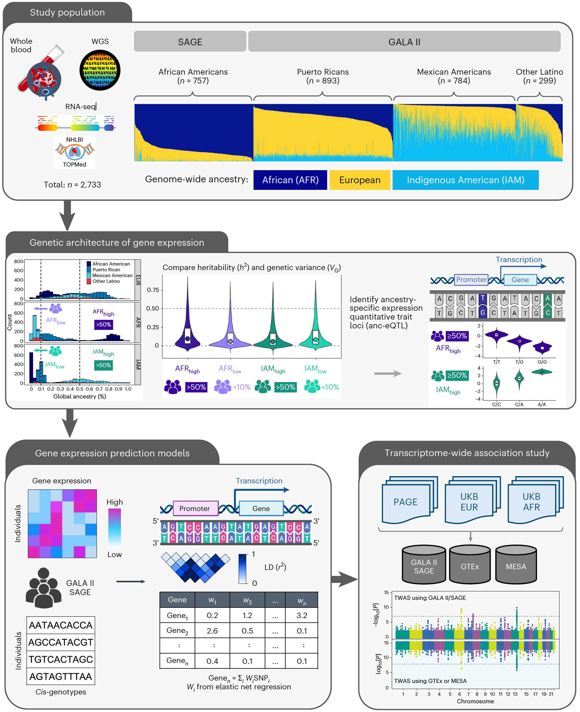

# Gene expression in African Americans and Latinos reveals ancestry-specific patterns of genetic architecture

This repository contains scripts of the publication:
Gene expression in African Americans and Latinos reveals ancestry-specific patterns of genetic architecture.
[Mak et. al (2023) Nat Genet 55(6):952-963](https://www.nature.com/articles/s41588-023-01377-z)

Summary statistics for cis- and trans-eQTLs, as well as TWAS models developed using data from GALA II and SAGE participants, can be found in [Zenodo (DOI:10.5281/zenodo.6622368)](https://zenodo.org/records/7735723)

Project overview

